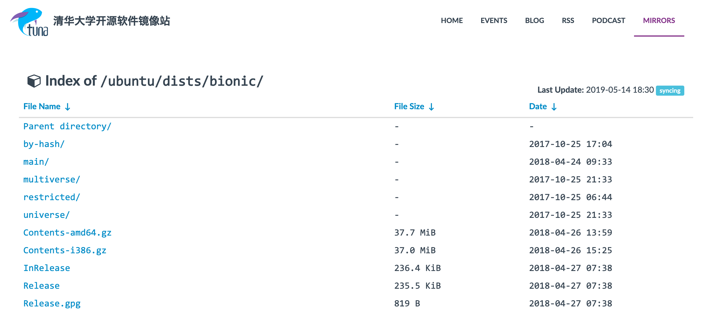

## 软件包
Linux 软件包主要有二进制包和源码包两种形式，Ubuntu 支持安装 deb 二进制包和 tarball 源码包。

## 软件仓储
软件仓储是软件包仓库，软件包管理工具可以连接到仓储搜索或者下载软件包。

Ubuntu 的软件仓储类型包括：

- `main`: 官方提供的软件包
- `restricted`: Ubuntu 支持，但没有自由软件版权
- `universe`: 由社区维护，不提供官方支持
- `multiverse`: 非自由软件

比如清华大学 Ubuntu 18.04(bionic) 仓储镜像：http://mirrors.tuna.tsinghua.edu.cn/ubuntu/

## 包管理工具 apt

Ubuntu apt 配置文件位于 `/etc/apt` 目录：

    drwxr-xr-x 2 root root 4.0K Apr 26 22:08 apt.conf.d
    drwxr-xr-x 2 root root 4.0K Mar 11 17:34 auth.conf.d
    drwxr-xr-x 2 root root 4.0K Apr 20  2018 preferences.d
    -rw-rw-r-- 1 root root 3.1K Apr 21 08:16 sources.list
    drwxr-xr-x 2 root root 4.0K Apr 21 09:36 sources.list.d
    -rw-rw-r-- 1 root root 3.0K Apr 21 08:16 sources.list.save
    -rw-r--r-- 1 root root 7.3K Apr 21 09:36 trusted.gpg
    -rw-r--r-- 1 root root 2.7K Apr 21 08:14 trusted.gpg~
    drwxr-xr-x 2 root root 4.0K Apr 21 09:36 trusted.gpg.d

其中 `apt.conf.d` 存储了主要配置文件，`sources.list` 保存了软件仓储的信息：

    # deb cdrom:[Ubuntu 18.04.2 LTS _Bionic Beaver_ - Release amd64 (20190210)]/ bionic main restricted

    # See http://help.ubuntu.com/community/UpgradeNotes for how to upgrade to
    # newer versions of the distribution.
    deb http://mirrors.tuna.tsinghua.edu.cn/ubuntu/ bionic main restricted
    # deb-src http://mirrors.tuna.tsinghua.edu.cn/ubuntu/ bionic main restricted

    ## Major bug fix updates produced after the final release of the
    ## distribution.
    deb http://mirrors.tuna.tsinghua.edu.cn/ubuntu/ bionic-updates main restricted
    # deb-src http://mirrors.tuna.tsinghua.edu.cn/ubuntu/ bionic-updates main restricted
    ...

`/var/lib/apt` 目录存储本地软件包索引：

    -rw-rw-r-- 1 root root  215 Apr 20 20:27 cdroms.list
    -rw-r--r-- 1 root root    0 May 14 13:29 daily_lock
    -rw-r--r-- 1 root root 4.9K May 12 06:18 extended_states
    drwxr-xr-x 4 root root  20K May 14 13:29 lists
    drwxr-xr-x 3 root root 4.0K Feb 10 08:12 mirrors
    drwxr-xr-x 2 root root 4.0K Apr 22 00:23 periodic

位于 `/etc/apt/sources.list` 中的每个软件仓储，`/var/lib/apt/lists` 目录中都会有一个索引文件与之对应，其中包含了每个软件包的最新信息。

    -rw-r--r-- 1 root root 237K Apr 27  2018 mirrors.tuna.tsinghua.edu.cn_ubuntu_dists_bionic_InRelease
    -rw-r--r-- 1 root root 6.0M Apr 27  2018 mirrors.tuna.tsinghua.edu.cn_ubuntu_dists_bionic_main_binary-amd64_Packages
    -rw-r--r-- 1 root root 5.9M Apr 27  2018 mirrors.tuna.tsinghua.edu.cn_ubuntu_dists_bionic_main_binary-i386_Packages
    ...

`/var/cache/apt/archives` 是软件包本地缓存目录，包含最近下载的软件包。

### 刷新软件仓储

查找，安装或升级软件包之前，需要先更新软件仓储的索引，以获得最新的软件包信息。

    $ sudo apt-get update

### 搜索软件包

`apt-cache` 用于管理缓存中的软件包，常用子命令有：

- `showpkg`: 查看软件包信息
- `search`: 搜索软件包
- `depends`: 显示软件包依赖关系
- `rdepends`: 显示反向依赖
- `madison`: 显示软件包所有版本
- `pkgnames`: 显示系统所有软件包

如查询

    $ apt-cache search vim

### 安装软件包
`apt-get` 的 `install` 子命令用于安装指定软件包。

    $ sudo apt-get install vim

使用 `-y` 选项对需要用户确认的请求，总是用 yes 回答。

### 重新安装软件包
如果软件无法正常使用，可以使用 `--reinstall` 选项选择重新安装软件包（不需要手动删除再安装）。

    $ sudo apt-get install --reinstall vim

### 删除软件包
Ubuntu 提供几种删除方式：

- `remove` 子命令，删除软件包，但某些配置文件保留
- `autoremove` 子命令，自动删除为满足本软件包的依赖而自动安装的但已经不需要的软件包
- `purge` 子命令，同时删除软件包和清除所有配置文件

注意区分 `remove` 和 `purge`:

    $ sudo apt-get remove vim
    $ sudo apt-get purge vim

### 更新软件包
使用 `update` 更新仓储索引后 `upgrade` 更新软件包：

    $ sudo apt-get update && sudo apt-get upgrade

软件包升级实际是一个删除与重新安装的操作，`apt-get` 会自动删除旧软件包然后安装新的。

## apt-get 常用子命令

- `install`: 安装软件包
- `update`: 同步软件仓储索引
- `upgrade`: 升级软件包
- `dist-upgrade`: 版本升级
- `remove`: 删除软件包
- `autoremove`: 删除软件包，并自动处理依赖
- `purge`: 测地清除软件包，包括配置文件
- `check`: 检查 apt 缓冲区，确定依赖包是否存在
- `clean`: 清除 apt 本地缓存
- `source`: 下载源码包
- `download`: 下载二进制包到当前目录

## apt-get 常用选项

- `-y`: 对于需要用户确认的请求，总是用 yes 回答
- `--no-download`: 禁止下载软件包
- `--download-only`: 仅下载软件包，不解压和安装
- `--reinstall`: 重新安装已经安装过的软件包
- `--allow-unauthenticated`: 运行安装未认证的软件包
- `--no-upgrade`: 禁止升级软件包